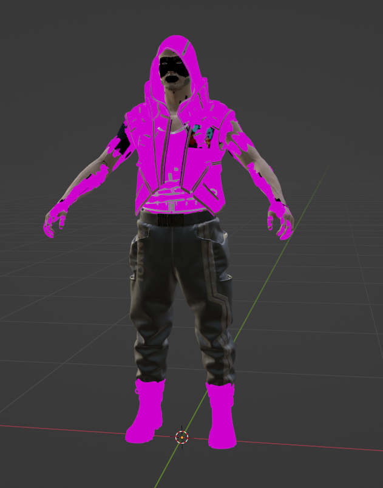
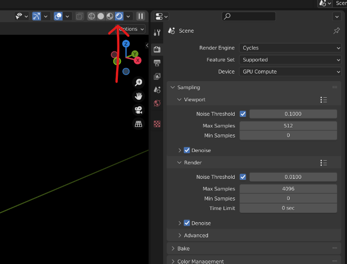

# ❗ Problems

## Brief

Due to the chaotic nature of people and problems, the problems in this section are not listed in any particular order. We will do our best to cater what goes here, but be prepared to read or use your browser's search tool.

### Structure

If the problem requires a sequence of steps then the solution will be numbered and should be followed as step 1, step 2, step 3, etc.. If the problem has multiple possible solutions then the solutions will be in an unordered (aka bulleted) list.

## Problems

1. <mark style="color:red;">Problem</mark>: WolvenKit locks up when I import PNG files.
   * This is normal behavior because WolvenKit is converting the PNG image into very large DDS files at QualityColor (BC7) or QualityColorR (BC4).
2. <mark style="color:red;">Problem</mark>: Even when using wkit plugin, Blender does not export models correctly.
   *   The mlmask looks like it failed to export.

       <figure><figcaption></figcaption></figure>
   *   Switch the rendered tab to use Cycle.

       <figure><figcaption></figcaption></figure>
3. <mark style="color:red;">Problem</mark>:&#x20;
   * .
4. <mark style="color:red;">Problem</mark>:&#x20;
   * .
5. <mark style="color:red;">Problem</mark>:&#x20;
   * .
6. <mark style="color:red;">Problem</mark>:
   *
