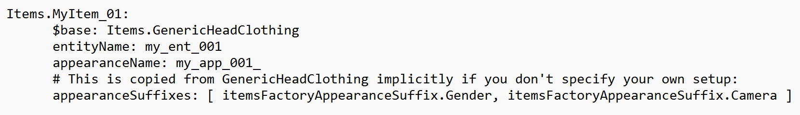
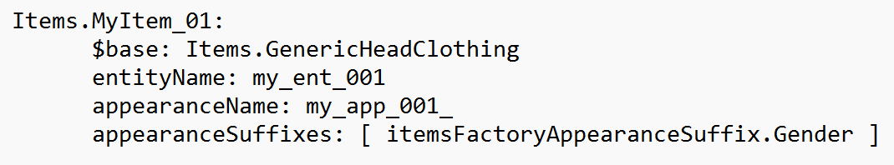
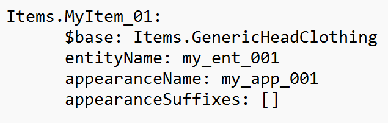

# ❔ FAQ

## Brief

Due to the chaotic nature of people asking questions, the questions in this section are not listed in any particular order. We will do our best to cater what goes here, but be prepared to read or use your browser's search tool.

### Structure

Some questions may have alternative answers, so the questions list has the questions numbered and the possible answered listed below it.

## Questions

1. <mark style="color:yellow;">Question</mark>: How do I combine two .mt files? Each file only has partial properties that I need.
   * Shaders cannot be edited because .mt files only contain exposed properties and set defaults, and shader code isn’t either of those. Attempting to copy properties from one asset into another that lacks those properties will not cause the second asset to gain those properties. There is an inherited relationship from .mi files to .mt files, so copying from an .mi to a .mt file won’t do anything because the property is already in the .mt file from the inheritance. Also, each submesh can only have one material assigned to it, you cannot mix materials. So you need to dredge the +200 materials in the game for the one that fits your needs. There is no viewer for those files, you have to work through each until you find the one you want.
2. <mark style="color:yellow;">Question</mark>: What do the name\_suffixes acronyms mean in the multilayered files?
   * \&FPP = First person perspective (i.e. the normal camera)
   * \&TPP = Third person perspective (usually photomode and mirrors, etc.)
   * The YAML file optionally refers to these names for the .Camera -> \&FPP or \&TPP depending on which is required. If you don’t intend to provide separate male and female versions then it's better to leave them out.
   * About appearance suffixes, they're controlled by appearanceSuffixes property of the item.&#x20;
     *   For example, when you clone Items.GenericHeadClothing you also implicitly copy suffixes setup:

         <figure><figcaption></figcaption></figure>
     *   you can disable \&TPP and \&FPP suffix:

         <figure><figcaption></figcaption></figure>
     * or disable all suffixes to always use the app named exactly my\_app\_001:
     * There are 4 predefined suffix types:
       1. itemsFactoryAppearanceSuffix.Gender
       2. itemsFactoryAppearanceSuffix.Camera
       3. itemsFactoryAppearanceSuffix.Partial -- checks if current item have hide\_T1part part and slot OuterChest is not hidden, adds \&Full or \&Part
       4. itemsFactoryAppearanceSuffix.HairType -- based on character customization adds \&Short, \&Long, \&Dreads, \&Buzz, \&Bald
3. <mark style="color:yellow;">Question</mark>: Is there a quick way through WolvenKit to find what is the value of a specific entry in the archives? For instance, "LocKey#1615". All I have found so far refers to a boot, but I am looking for a car's display name.
   * Loc(alization)Keys should be in the onscreens files. Make sure you are looking at the entry number within the file instead of the primary key.
4. <mark style="color:yellow;">Question</mark>: Is there a way to get all inner torso clothing items to hide their sleeves when creating an outer torso clothing item? Looking at visual tags but not a 100% sure if that's what I need.
   * If all inner torso items have separate submeshes for sleeves, then this can be done with parts overrides, but you'll need to define a chunk mask for each item individually. the normal way would be to use **hide\_T1part** visual tag on outer torso item it will trigger partial mode for any inner torso item that implements Partial suffix but if inner torso item doesn't implement the suffix, you can't force it. the suffix is used by inner torso item to react to outer torso item, and the outer torso item needs hide\_T1part visual tag to toggle the suffix for inner torso items. For an example, all vanilla items probably implement the suffix
5. <mark style="color:yellow;">Question</mark>:&#x20;
   * .
6. <mark style="color:yellow;">Question</mark>:
   * .
