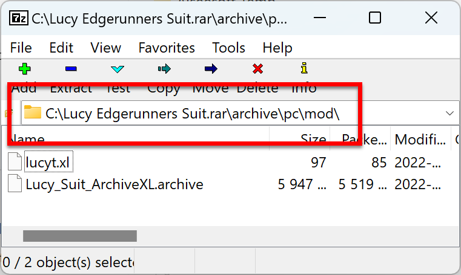

# ⚒ Manual Install

## Brief

For many modders, installing manually is still the default. It's realatively simple to do once you get used to it. With that being said, I for one use Vertex when I can before I'm lazy.

## Manual Install

1. You will need to know where your game is installed. If you installed through the gaming platforms Steam or GOG, and you installed the gaming platform into its default locations, then Cyberpunk should be installed in one of these two locations:
   * **Steam --** `C:\Program Files (x86)\Steam\steamapps\common\Cyberpunk 2077`
   * **GOG** -- `C:\Program Files (x86)\GOG Galaxy\Games\Cyberpunk 2077`
2. <mark style="color:yellow;">As of December 2022</mark>, Cyberpunk has two versions of mods that are installed in different locations. The legacy mods are placed into the directory `.\Cyberpunk 2077\archive\pc\content`, and their files are grouped together into a single folder. The updated  mods, titled REDmod, are placed into the directory `.\Cyberpunk 2077\mods\<mod's name>` and each mod has its own folder.
3. Most mods are downloaded in a compressed file (ZIP, RAR, 7ZIP) If your computer cannot natively uncompressed the file, then you will need to install a compression program like [7zip](https://www.google.com/url?sa=t\&rct=j\&q=\&esrc=s\&source=web\&cd=\&cad=rja\&uact=8\&ved=2ahUKEwiPtvyQzpj7AhULAjQIHd45A9kQjBB6BAgOEAE\&url=https%3A%2F%2Fwww.7-zip.org%2Fdownload.html\&usg=AOvVaw23fKx1DpPhVScae9xP9KRL).
4.  The compressed file should already be in the directory structure it needs to be extract in, so you should be able to extract it into '.\Cyberpunk 2077' and it'll be uncompressed into the correct location. In the screenshot  can see that this is a legacy mod that gets installed into the archive folder.

    <figure><figcaption>
7zip uncompressed screenshot of a mod
</figcaption></figure>
